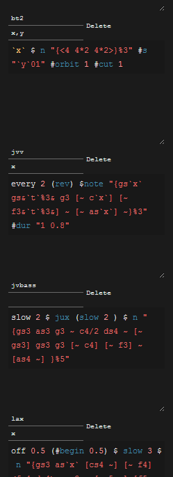

# Siren

*Siren*, a software environment that fills the gap between live coding performance and algorithmic composition. It is based on a hierarchical structure and a tracker-inspired user interface on top of the [TidalCycles](https://github.com/tidalcycles/Tidal/) language for pattern programming. In addition to pattern composition, *Siren* supports programming variations of and transitions between patterns.

**Note:** This is a beta release (*v0.1b*). If you come across a bug, please do submit an `issue` on this page, and/or create a `pull request` of you feel like participating in its development.

## Download

In order to download a copy of the repository, either download repository `as a ZIP file` at [https://github.com/cannc4/sq](github.com/cannc4/sq), or use command line to `clone` repository.

```
git clone https://github.com/cannc4/Siren.git
```

## Build and Run

### Dependencies:
Make sure the latest versions of following software are installed in your system

- [SuperCollider](http://supercollider.github.io/download.html)
- [NodeJS](https://nodejs.org/en/download/)
- [TidalCycles](https://tidalcycles.org/getting_started.html)

Then follow these lines to install package dependencies:

```
cd path/to/siren
npm i
```

In order to bind software dependencies, edit full paths in `config/config.json` according to your file system formatting and save the file. Now you can start the interface
also copy paste your `scd-start-default.scd` and `tidal-boot-default.hs` into config folder
```
npm start
```

and initialize the backend
```
npm run siren
```
then go to `http://localhost:3000/` or `http://127.0.0.1:3000/` in your browser (tested on Chrome)

*Tested on Windows 10 and MacOSX El Capitan*

## Usage


- Login / Logout to the system using Github authentication
- Boot `SuperCollider` by pressing the square button
  + The button will turn into a circle once it successfully boots (check console for possible errors)
- Start all timers with `play` button

## Scenes
|  |  |  |   
|---|---|---|
| **Figure (a)** | **Figure (b)** | **Figure (c)** |

### Duration

Duration of each channel can be specified using the textarea next to channel number on top of the grid. Duration is the time it takes to reach the last step in seconds.

`ctrl + enter` starts selected timer and `shift + enter` stops it.

*examples in Figure (b)*
- Channel number (i.e. `2`)
- Channel duration (i.e. `20` seconds)

### Dictionary

Tidal patterns are stored in the `dictionary` on the right hand side of the interface.

*example in Figure (c)*
- Patterns named `bt2`, `jvv`, `jvbass`, and `lax` with 2, 1, 0 and 1 parameters, respectively.

### Pattern Functions

Patterns can be looked up from the dictionary with their names and parameters. See `parameters` for various types.

*example in Figure (b)*
- Pattern functions in cells (i.e. ```bt2 `every 2(#coarse 12)` `c` ```)

### Transitions
Transitions are stored in the bottom row of the grid and are unique for each scene.

*example in Figure (b)*
- Transition function (i.e. `(clutchIn 4)`)

### Song mode
If toggled, scenes are iterated top-down fashion based on their ordering. It updates the active scene by writing its grid and dictionary once all timers reach to the last step of the scene.

- To save a new scene, input a name and click on `Add` button. It'll create a new item in the list below.
- Update your saved grid and dictionary by inputting the active scene's name to the textbox and clicking on `Update` button.
- Use `arrow keys` next to the item to reorder.
- Press ` x ` button if you want to delete the scene all together.

*example in Figure (a)*
- Textbox for scene name (i.e. `docs`)
- `Update`/`Add` button
- `Clear Matrix` button
- `Start`/`Stop Songmode` to enable above feature
- Scenes are itemized with `delete` and `reorder` functionalities  

## Parameters
### Mathematical expressions
Mathematical expressions can be used in the patterns in the dictionary, parser evaluates the expressions when enclosed with `&` symbol.

*example in Figure (c)*
- Math expression enclosed by `& ... &` (i.e. in the body of `jvv`: ```... [~ f3 &`t`%3 &] ~ ...```)

### Random Parameters
``` `[x,y]` ``` returns a random value within the `x` and `y` boundaries `[x,y)`.

### Temporal Parameter
``` `t` ``` represents the temporal parameter for each timer and it can be used in expressions to create complex values, especially with math expressions.

## Notes
- Pause timers for a few seconds if you see too much flood in GHC terminal. (stack gets full)
- `npm run siren` starts up the server - it's not required if you want to refresh the interface however you need to manually close node and restart it if `scsynth` crashes
- As each cell contains a pattern, having a timer duration like 4 seconds doesn't really makes sense if you have 8 steps (i.e. 4/8 seconds per step)

## Known Bugs
- Timer start/stop fails on quick toggle (restart requires)
- Editing parameters in the patterns fails when timer is active
- To be listed
